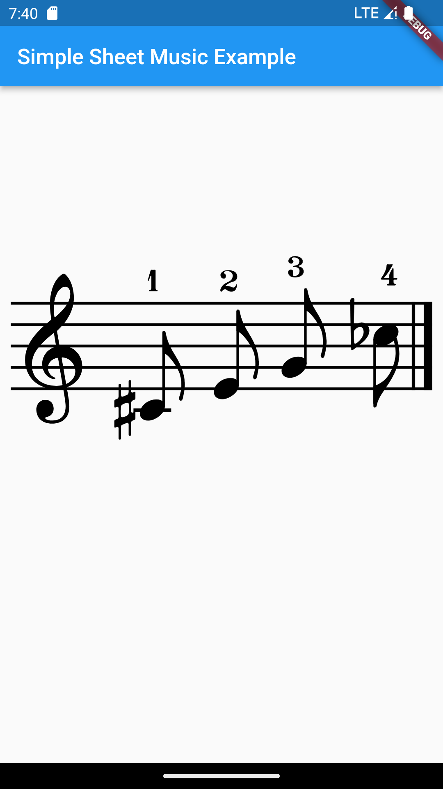

<!-- 
This README describes the package. If you publish this package to pub.dev,
this README's contents appear on the landing page for your package.

For information about how to write a good package README, see the guide for
[writing package pages](https://dart.dev/guides/libraries/writing-package-pages). 

For general information about developing packages, see the Dart guide for
[creating packages](https://dart.dev/guides/libraries/create-library-packages)
and the Flutter guide for
[developing packages and plugins](https://flutter.dev/developing-packages). 
-->

A Flutter plugin for rendering sheet music on canvas.

## Features



## Usage

TODO: Include short and useful examples for package users. Add longer examples
to `/example` folder. 

```dart
musicObjects = [
    const Clef(ClefType.treble),
    const Note(
        pitch: Pitch.c4,
        noteDuration: NoteDuration.eighth,
        accidental: Accidental.sharp,
        fingering: Fingering.one),
    const Note(
        pitch: Pitch.e4,
        noteDuration: NoteDuration.eighth,
        fingering: Fingering.two),
    const Note(
        pitch: Pitch.g4,
        noteDuration: NoteDuration.eighth,
        fingering: Fingering.three),
    const Note(
        pitch: Pitch.c5,
        noteDuration: NoteDuration.eighth,
        accidental: Accidental.flat,
        fingering: Fingering.four),
];
measure = Measure(musicObjects);
staff = Staff([measure]);
SimpleSheetMusic(
    initialClefType: ClefType.treble,
    staffs: [staff],
)
```

## Future plans
Currently planned additions are as follows.

<li>Time signatures<br>
<li>Rests<br>
<li>Various fonts<br>
<li>Enrich gestures<br>
<li>import from MIDI, MusicXML<br>
<li>Grand staff<br>
...
