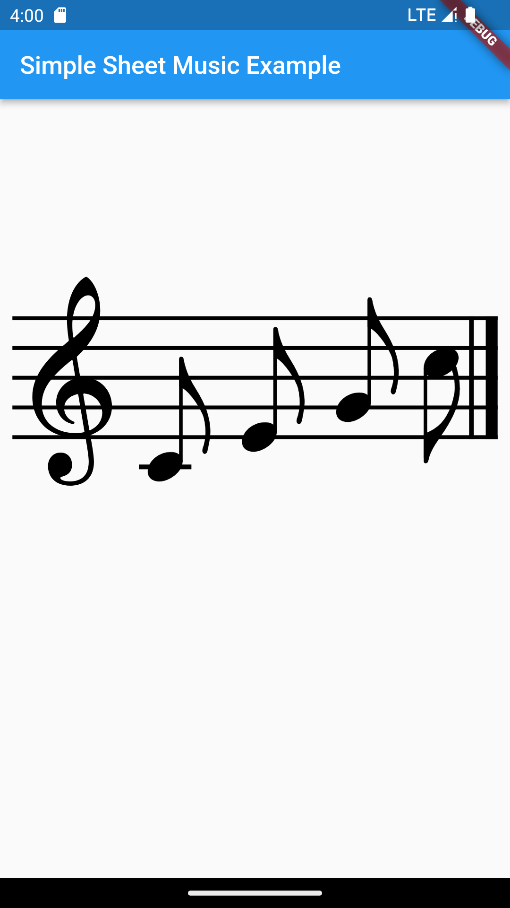

<!-- 
This README describes the package. If you publish this package to pub.dev,
this README's contents appear on the landing page for your package.

For information about how to write a good package README, see the guide for
[writing package pages](https://dart.dev/guides/libraries/writing-package-pages). 

For general information about developing packages, see the Dart guide for
[creating packages](https://dart.dev/guides/libraries/create-library-packages)
and the Flutter guide for
[developing packages and plugins](https://flutter.dev/developing-packages). 
-->

A Flutter plugin for rendering sheet music on canvas.

## Features

This Plugin is a beta version.<br>
Currently supported music symbols<br>
<li>Clefs 
<li>Note, Accidentals, Fingerings.

<br>



## Usage

TODO: Include short and useful examples for package users. Add longer examples
to `/example` folder. 

```dart
musicObjects = [
    Clef(ClefType.treble),
    Note(pitch: Pitch.c4, noteDuration: NoteDuration.eighth),
    Note(pitch: Pitch.e4, noteDuration: NoteDuration.eighth),
    Note(pitch: Pitch.g4, noteDuration: NoteDuration.eighth),
    Note(pitch: Pitch.c5, noteDuration: NoteDuration.eighth)
];
measure = Measure(musicObjects);
staff = Staff([measure]);
SimpleSheetMusic(
    initialClefType: ClefType.treble,
    staffs: [staff],
)
```

## Future plans
Time signatures<br>
Enrich gestures<br>
import from MIDI, MusicXML<br>
various fonts<br>


## Additional information

TODO: Tell users more about the package: where to find more information, how to 
contribute to the package, how to file issues, what response they can expect 
from the package authors, and more.
